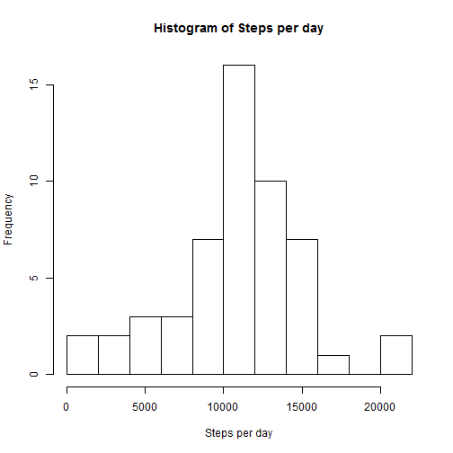
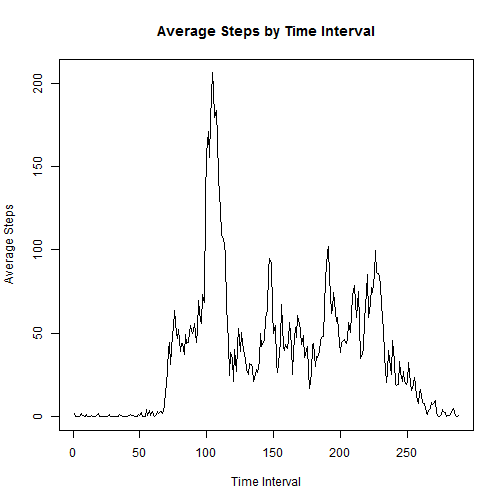
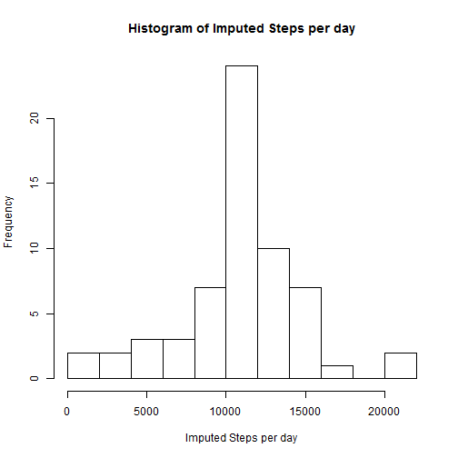

# Reproducible Research: Peer Assessment 1

## Loading and preprocessing the data

Note: This program assumes that the data is located in the working directory

The data is initially loaded and appended with factor and index columns.


```r
activities <- read.csv("activity.csv")

# Rename the date column to datefactor to indicate that it is a factor
# variable
names(activities)[2] <- "datefactor"

# Create a Date column with the Date class type
date <- as.Date(as.character(activities$datefactor))
activities <- cbind(activities, date)

# Create a column to indicate the day of the week
dayofweek <- weekdays(activities$date)
dayofweekfactor <- as.factor(dayofweek)
activities <- cbind(activities, dayofweekfactor)

# Create a daytype factor column to indicate a weekday or weekend
weekendTF <- weekdays(activities$date) == "Sunday" | weekdays(activities$date) == 
    "Saturday"
weekendday <- dayofweek
weekendday[weekendTF] <- "weekend"
weekendday[weekendTF == FALSE] <- "weekday"
daytypefactor <- as.factor(weekendday)
activities <- cbind(activities, daytypefactor)

# Create a factor column for the intervals.  This will be used to split the
# data.
intervalfactor <- as.factor(activities$interval)
activities <- cbind(activities, intervalfactor)

# Create a column that indexes the 5-minute interval
intervalindex <- as.numeric(intervalfactor)
activities <- cbind(activities, intervalindex)

# tidy up the data set
activities <- data.frame(steps = activities$steps, date = activities$date, datefactor = activities$datefactor, 
    dayofweekfactor = activities$dayofweekfactor, daytypefactor = activities$daytypefactor, 
    interval = activities$interval, intervalfactor = activities$intervalfactor, 
    intervalindex = activities$intervalindex)

# Inspect the resulting data set
head(activities)
```

```
##   steps       date datefactor dayofweekfactor daytypefactor interval
## 1    NA 2012-10-01 2012-10-01          Monday       weekday        0
## 2    NA 2012-10-01 2012-10-01          Monday       weekday        5
## 3    NA 2012-10-01 2012-10-01          Monday       weekday       10
## 4    NA 2012-10-01 2012-10-01          Monday       weekday       15
## 5    NA 2012-10-01 2012-10-01          Monday       weekday       20
## 6    NA 2012-10-01 2012-10-01          Monday       weekday       25
##   intervalfactor intervalindex
## 1              0             1
## 2              5             2
## 3             10             3
## 4             15             4
## 5             20             5
## 6             25             6
```


## What is mean total number of steps taken per day?

The data is split by date.  Then a vector is created to hold the total steps by date.


```r
activities_steps_splitbydate <- with(activities, split(steps, datefactor))
activities_steps_splitbydate_total <- sapply(activities_steps_splitbydate, sum)
```


This histogram shows the frequency distribution of steps per day.


```r
hist(activities_steps_splitbydate_total, xlab = "Steps per day", main = "Histogram of Steps per day", 
    breaks = 10)
```

 

```r

activities_steps_splitbydate_total_df <- data.frame(total = activities_steps_splitbydate_total)
print(activities_steps_splitbydate_total_df)
```

```
##            total
## 2012-10-01    NA
## 2012-10-02   126
## 2012-10-03 11352
## 2012-10-04 12116
## 2012-10-05 13294
## 2012-10-06 15420
## 2012-10-07 11015
## 2012-10-08    NA
## 2012-10-09 12811
## 2012-10-10  9900
## 2012-10-11 10304
## 2012-10-12 17382
## 2012-10-13 12426
## 2012-10-14 15098
## 2012-10-15 10139
## 2012-10-16 15084
## 2012-10-17 13452
## 2012-10-18 10056
## 2012-10-19 11829
## 2012-10-20 10395
## 2012-10-21  8821
## 2012-10-22 13460
## 2012-10-23  8918
## 2012-10-24  8355
## 2012-10-25  2492
## 2012-10-26  6778
## 2012-10-27 10119
## 2012-10-28 11458
## 2012-10-29  5018
## 2012-10-30  9819
## 2012-10-31 15414
## 2012-11-01    NA
## 2012-11-02 10600
## 2012-11-03 10571
## 2012-11-04    NA
## 2012-11-05 10439
## 2012-11-06  8334
## 2012-11-07 12883
## 2012-11-08  3219
## 2012-11-09    NA
## 2012-11-10    NA
## 2012-11-11 12608
## 2012-11-12 10765
## 2012-11-13  7336
## 2012-11-14    NA
## 2012-11-15    41
## 2012-11-16  5441
## 2012-11-17 14339
## 2012-11-18 15110
## 2012-11-19  8841
## 2012-11-20  4472
## 2012-11-21 12787
## 2012-11-22 20427
## 2012-11-23 21194
## 2012-11-24 14478
## 2012-11-25 11834
## 2012-11-26 11162
## 2012-11-27 13646
## 2012-11-28 10183
## 2012-11-29  7047
## 2012-11-30    NA
```


Finally, calculate the mean and median steps per day.  Ignore any NAs.


```r
activities_steps_splitbydate_mean = format(mean(activities_steps_splitbydate_total_df$total, 
    na.rm = TRUE), digits = 6, nsmall = 2)
activities_steps_splitbydate_median = median(activities_steps_splitbydate_total_df$total, 
    na.rm = TRUE)
```


The mean steps per day is 10766.19.  The median steps per day is 10765.  The distribution is fairly symmetric.


## What is the average daily activity pattern?

Split the data by time interval and calculate the mean for each interval.


```r
# Split by interval
activities_steps_splitbyinterval <- with(activities, split(steps, intervalfactor))

# Calculate each interval's mean.
activities_steps_splitbyinterval_mean <- sapply(activities_steps_splitbyinterval, 
    mean, na.rm = TRUE)

# Inspect the data.
head(activities_steps_splitbyinterval_mean)
```

```
##       0       5      10      15      20      25 
## 1.71698 0.33962 0.13208 0.15094 0.07547 2.09434
```


The name of each value in the mean vector corresponds to the time of day (e.g., 0=midnight, 100=1:00 AM, 1300=1:00 PM, etc.).

Plot the average number of steps as a time series.  Since, the time series must be over contiguous segments, the x-axis is represented by the interval index.


```r
plot(activities_steps_splitbyinterval_mean, type = "l", main = "Average Steps by Time Interval", 
    xlab = "Time Interval", ylab = "Average Steps")
```

 


Find the interval that is represented by the peak in the above graph.


```r
maxindex_steps_splitbyinterval_mean <- which(activities_steps_splitbyinterval_mean == 
    max(activities_steps_splitbyinterval_mean))
maxtimeinterval <- names(maxindex_steps_splitbyinterval_mean)[1]
```


The most activity occurred at the 104 interval which corresponds to the 835 time interval.

## Imputing missing values

Find the number of records that are missing steps.


```r
# Total number of missing values
missingsteps <- is.na(activities$steps)
missingstepscount <- sum(missingsteps)
```


There are 2304 observations in which the step count is missing.

The step count will be imputed by using the average number of steps in the same time interval in the other days of the study.  A column titled 'imputedsteps' will be added to the data frame.


```r
# Create the imputed steps based on the average steps in each interval
imputedsteps <- activities$steps
activities <- cbind(activities, imputedsteps)
activities$imputedsteps[missingsteps] <- activities_steps_splitbyinterval_mean[activities$intervalfactor[missingsteps]]

# Analyze the impact of the imputed steps by splitting across days again.
activities_imputedsteps_splitbydate <- with(activities, split(imputedsteps, 
    datefactor))
activities_imputedsteps_splitbydate_total <- sapply(activities_imputedsteps_splitbydate, 
    sum)
```


This histogram shows the frequency distribution of steps per day, including the imputed steps.


```r
hist(activities_imputedsteps_splitbydate_total, xlab = "Imputed Steps per day", 
    main = "Histogram of Imputed Steps per day", breaks = 10)
```

 

```r

activities_imputedsteps_splitbydate_total_df <- data.frame(total = activities_imputedsteps_splitbydate_total)

print(activities_imputedsteps_splitbydate_total_df)
```

```
##            total
## 2012-10-01 10766
## 2012-10-02   126
## 2012-10-03 11352
## 2012-10-04 12116
## 2012-10-05 13294
## 2012-10-06 15420
## 2012-10-07 11015
## 2012-10-08 10766
## 2012-10-09 12811
## 2012-10-10  9900
## 2012-10-11 10304
## 2012-10-12 17382
## 2012-10-13 12426
## 2012-10-14 15098
## 2012-10-15 10139
## 2012-10-16 15084
## 2012-10-17 13452
## 2012-10-18 10056
## 2012-10-19 11829
## 2012-10-20 10395
## 2012-10-21  8821
## 2012-10-22 13460
## 2012-10-23  8918
## 2012-10-24  8355
## 2012-10-25  2492
## 2012-10-26  6778
## 2012-10-27 10119
## 2012-10-28 11458
## 2012-10-29  5018
## 2012-10-30  9819
## 2012-10-31 15414
## 2012-11-01 10766
## 2012-11-02 10600
## 2012-11-03 10571
## 2012-11-04 10766
## 2012-11-05 10439
## 2012-11-06  8334
## 2012-11-07 12883
## 2012-11-08  3219
## 2012-11-09 10766
## 2012-11-10 10766
## 2012-11-11 12608
## 2012-11-12 10765
## 2012-11-13  7336
## 2012-11-14 10766
## 2012-11-15    41
## 2012-11-16  5441
## 2012-11-17 14339
## 2012-11-18 15110
## 2012-11-19  8841
## 2012-11-20  4472
## 2012-11-21 12787
## 2012-11-22 20427
## 2012-11-23 21194
## 2012-11-24 14478
## 2012-11-25 11834
## 2012-11-26 11162
## 2012-11-27 13646
## 2012-11-28 10183
## 2012-11-29  7047
## 2012-11-30 10766
```


Finally, calculate the mean and median steps per day.  This time there are no NAs to ignore.


```r
activities_imputedsteps_splitbydate_mean = format(mean(activities_imputedsteps_splitbydate_total), 
    digits = 6, nsmall = 2)
activities_imputedsteps_splitbydate_median = format(median(activities_imputedsteps_splitbydate_total), 
    digits = 6, nsmall = 2)
```


The mean steps per day is 10766.19.  The median steps per day is 10766.19.  The mean did not change, but now the median is more in line with the mean resulting in a distribution that is now even more symmetric.

## Are there differences in activity patterns between weekdays and weekends?

subset the data into two data frames, one for weekend dates and the other for weekend dates and then split each by the time interval.  


```r
# Split each subset by the time interval.
activities_imputedsteps_splitbyinterval_weekend <- with(subset(activities, daytypefactor == 
    "weekend"), split(imputedsteps, intervalfactor))
activities_imputedsteps_splitbyinterval_weekday <- with(subset(activities, daytypefactor == 
    "weekday"), split(imputedsteps, intervalfactor))

# Calculate the mean within each data frame.
activities_imputedsteps_splitbyinterval_weekend_mean <- sapply(activities_imputedsteps_splitbyinterval_weekend, 
    mean)
activities_imputedsteps_splitbyinterval_weekday_mean <- sapply(activities_imputedsteps_splitbyinterval_weekday, 
    mean)
```


Plot the average number of steps in each time interval for each data frame.


```r
par(mfrow = c(2, 1))
plot(activities_imputedsteps_splitbyinterval_weekend_mean, type = "l", main = "weekend", 
    xlab = "Time Interval", ylab = "Average Imputed Steps", ylim = c(0, 250))
plot(activities_imputedsteps_splitbyinterval_weekday_mean, type = "l", main = "weekday", 
    xlab = "Time Interval", ylab = "Average Imputed Steps", ylim = c(0, 250))
```

 


Notice that the weekend activity has peaks throughout the day, but the weekday activity tends to consolidate more activity earlier in the day.

