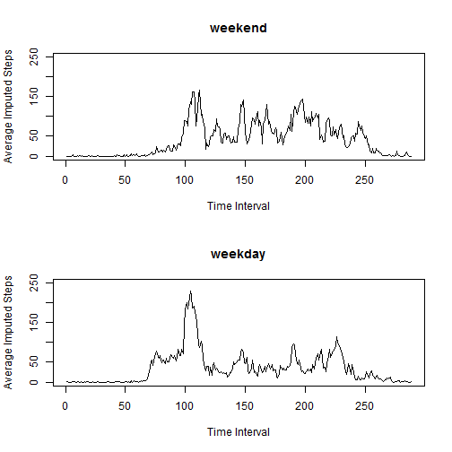

# Reproducible Research: Peer Assessment 1

## Loading and preprocessing the data

Note: This program assumes that the data is located in the working directory


```r
activities <- read.csv("activity.csv")
names(activities)[2] <- "datefactor"

date <- as.Date(as.character(activities$datefactor))
activities <- cbind(activities, date)

dayofweek <- weekdays(activities$date)
dayofweekfactor <- as.factor(dayofweek)
activities <- cbind(activities, dayofweekfactor)

weekendTF <- weekdays(activities$date) == "Sunday" | weekdays(activities$date) == 
    "Saturday"
weekendday <- dayofweek
weekendday[weekendTF] <- "weekend"
weekendday[weekendTF == FALSE] <- "weekday"
daytypefactor <- as.factor(weekendday)
activities <- cbind(activities, daytypefactor)

intervalfactor <- as.factor(activities$interval)
activities <- cbind(activities, intervalfactor)

intervalindex <- as.numeric(intervalfactor)
activities <- cbind(activities, intervalindex)

# tidy up the data set
activities <- data.frame(steps = activities$steps, date = activities$date, datefactor = activities$datefactor, 
    dayofweekfactor = activities$dayofweekfactor, daytypefactor = activities$daytypefactor, 
    interval = activities$interval, intervalfactor = activities$intervalfactor, 
    intervalindex = activities$intervalindex)

head(activities)
```

```
##   steps       date datefactor dayofweekfactor daytypefactor interval
## 1    NA 2012-10-01 2012-10-01          Monday       weekday        0
## 2    NA 2012-10-01 2012-10-01          Monday       weekday        5
## 3    NA 2012-10-01 2012-10-01          Monday       weekday       10
## 4    NA 2012-10-01 2012-10-01          Monday       weekday       15
## 5    NA 2012-10-01 2012-10-01          Monday       weekday       20
## 6    NA 2012-10-01 2012-10-01          Monday       weekday       25
##   intervalfactor intervalindex
## 1              0             1
## 2              5             2
## 3             10             3
## 4             15             4
## 5             20             5
## 6             25             6
```


## What is mean total number of steps taken per day?

```r
activities_steps_splitbydate <- with(activities, split(steps, datefactor))
activities_steps_splitbydate_total <- sapply(activities_steps_splitbydate, sum, 
    na.rm = TRUE)
activities_steps_splitbydate_mean <- sapply(activities_steps_splitbydate, mean, 
    na.rm = TRUE)
activities_steps_splitbydate_median <- sapply(activities_steps_splitbydate, 
    median, na.rm = TRUE)

hist(activities_steps_splitbydate_total, xlab = "Steps per day", main = "Histogram of Steps per day", 
    breaks = 10)
```

 

```r

activities_steps_splitbydate_meanmedian_df <- data.frame(mean = activities_steps_splitbydate_mean, 
    median = activities_steps_splitbydate_median)

print(activities_steps_splitbydate_meanmedian_df)
```

```
##               mean median
## 2012-10-01     NaN     NA
## 2012-10-02  0.4375      0
## 2012-10-03 39.4167      0
## 2012-10-04 42.0694      0
## 2012-10-05 46.1597      0
## 2012-10-06 53.5417      0
## 2012-10-07 38.2465      0
## 2012-10-08     NaN     NA
## 2012-10-09 44.4826      0
## 2012-10-10 34.3750      0
## 2012-10-11 35.7778      0
## 2012-10-12 60.3542      0
## 2012-10-13 43.1458      0
## 2012-10-14 52.4236      0
## 2012-10-15 35.2049      0
## 2012-10-16 52.3750      0
## 2012-10-17 46.7083      0
## 2012-10-18 34.9167      0
## 2012-10-19 41.0729      0
## 2012-10-20 36.0938      0
## 2012-10-21 30.6285      0
## 2012-10-22 46.7361      0
## 2012-10-23 30.9653      0
## 2012-10-24 29.0104      0
## 2012-10-25  8.6528      0
## 2012-10-26 23.5347      0
## 2012-10-27 35.1354      0
## 2012-10-28 39.7847      0
## 2012-10-29 17.4236      0
## 2012-10-30 34.0938      0
## 2012-10-31 53.5208      0
## 2012-11-01     NaN     NA
## 2012-11-02 36.8056      0
## 2012-11-03 36.7049      0
## 2012-11-04     NaN     NA
## 2012-11-05 36.2465      0
## 2012-11-06 28.9375      0
## 2012-11-07 44.7326      0
## 2012-11-08 11.1771      0
## 2012-11-09     NaN     NA
## 2012-11-10     NaN     NA
## 2012-11-11 43.7778      0
## 2012-11-12 37.3785      0
## 2012-11-13 25.4722      0
## 2012-11-14     NaN     NA
## 2012-11-15  0.1424      0
## 2012-11-16 18.8924      0
## 2012-11-17 49.7882      0
## 2012-11-18 52.4653      0
## 2012-11-19 30.6979      0
## 2012-11-20 15.5278      0
## 2012-11-21 44.3993      0
## 2012-11-22 70.9271      0
## 2012-11-23 73.5903      0
## 2012-11-24 50.2708      0
## 2012-11-25 41.0903      0
## 2012-11-26 38.7569      0
## 2012-11-27 47.3819      0
## 2012-11-28 35.3576      0
## 2012-11-29 24.4688      0
## 2012-11-30     NaN     NA
```


## What is the average daily activity pattern?

```r
activities_steps_splitbyinterval <- with(activities, split(steps, intervalfactor))
activities_steps_splitbyinterval_mean <- sapply(activities_steps_splitbyinterval, 
    mean, na.rm = TRUE)
head(activities_steps_splitbyinterval_mean)
```

```
##       0       5      10      15      20      25 
## 1.71698 0.33962 0.13208 0.15094 0.07547 2.09434
```

```r

plot(activities_steps_splitbyinterval_mean, type = "l", main = "Average Steps by Time Interval", 
    xlab = "Time Interval", ylab = "Average Steps")
```

 

```r

max_steps_meanbyinterval <- which(activities_steps_splitbyinterval_mean == max(activities_steps_splitbyinterval_mean))
names(max_steps_meanbyinterval)[1]
```

```
## [1] "835"
```


## Imputing missing values

```r
# Total number of missing values
missingsteps <- is.na(activities$steps)
sum(missingsteps)
```

```
## [1] 2304
```

```r

# create the imputed steps based on the average steps in each interval
imputedsteps <- activities$steps
activities <- cbind(activities, imputedsteps)
activities$imputedsteps[missingsteps] <- activities_steps_splitbyinterval_mean[activities$intervalfactor[missingsteps]]

# analyze the imputed steps
activities_imputedsteps_splitbydate <- with(activities, split(imputedsteps, 
    datefactor))
activities_imputedsteps_splitbydate_total <- sapply(activities_imputedsteps_splitbydate, 
    sum)
activities_imputedsteps_splitbydate_mean <- sapply(activities_imputedsteps_splitbydate, 
    mean)
activities_imputedsteps_splitbydate_median <- sapply(activities_imputedsteps_splitbydate, 
    median)

hist(activities_imputedsteps_splitbydate_total, xlab = "Imputed Steps per day", 
    main = "Histogram of Imputed Steps per day", breaks = 10)
```

 

```r

activities_imputedsteps_splitbydate_meanmedian_df <- data.frame(mean = activities_imputedsteps_splitbydate_mean, 
    median = activities_imputedsteps_splitbydate_median)

print(activities_imputedsteps_splitbydate_meanmedian_df)
```

```
##               mean median
## 2012-10-01 37.3826  34.11
## 2012-10-02  0.4375   0.00
## 2012-10-03 39.4167   0.00
## 2012-10-04 42.0694   0.00
## 2012-10-05 46.1597   0.00
## 2012-10-06 53.5417   0.00
## 2012-10-07 38.2465   0.00
## 2012-10-08 37.3826  34.11
## 2012-10-09 44.4826   0.00
## 2012-10-10 34.3750   0.00
## 2012-10-11 35.7778   0.00
## 2012-10-12 60.3542   0.00
## 2012-10-13 43.1458   0.00
## 2012-10-14 52.4236   0.00
## 2012-10-15 35.2049   0.00
## 2012-10-16 52.3750   0.00
## 2012-10-17 46.7083   0.00
## 2012-10-18 34.9167   0.00
## 2012-10-19 41.0729   0.00
## 2012-10-20 36.0938   0.00
## 2012-10-21 30.6285   0.00
## 2012-10-22 46.7361   0.00
## 2012-10-23 30.9653   0.00
## 2012-10-24 29.0104   0.00
## 2012-10-25  8.6528   0.00
## 2012-10-26 23.5347   0.00
## 2012-10-27 35.1354   0.00
## 2012-10-28 39.7847   0.00
## 2012-10-29 17.4236   0.00
## 2012-10-30 34.0938   0.00
## 2012-10-31 53.5208   0.00
## 2012-11-01 37.3826  34.11
## 2012-11-02 36.8056   0.00
## 2012-11-03 36.7049   0.00
## 2012-11-04 37.3826  34.11
## 2012-11-05 36.2465   0.00
## 2012-11-06 28.9375   0.00
## 2012-11-07 44.7326   0.00
## 2012-11-08 11.1771   0.00
## 2012-11-09 37.3826  34.11
## 2012-11-10 37.3826  34.11
## 2012-11-11 43.7778   0.00
## 2012-11-12 37.3785   0.00
## 2012-11-13 25.4722   0.00
## 2012-11-14 37.3826  34.11
## 2012-11-15  0.1424   0.00
## 2012-11-16 18.8924   0.00
## 2012-11-17 49.7882   0.00
## 2012-11-18 52.4653   0.00
## 2012-11-19 30.6979   0.00
## 2012-11-20 15.5278   0.00
## 2012-11-21 44.3993   0.00
## 2012-11-22 70.9271   0.00
## 2012-11-23 73.5903   0.00
## 2012-11-24 50.2708   0.00
## 2012-11-25 41.0903   0.00
## 2012-11-26 38.7569   0.00
## 2012-11-27 47.3819   0.00
## 2012-11-28 35.3576   0.00
## 2012-11-29 24.4688   0.00
## 2012-11-30 37.3826  34.11
```


## Are there differences in activity patterns between weekdays and weekends?

```r
activities_imputedsteps_splitbyinterval_weekend <- with(subset(activities, daytypefactor == 
    "weekend"), split(imputedsteps, intervalfactor))
activities_imputedsteps_splitbyinterval_weekday <- with(subset(activities, daytypefactor == 
    "weekday"), split(imputedsteps, intervalfactor))
activities_imputedsteps_splitbyinterval_weekend_mean <- sapply(activities_imputedsteps_splitbyinterval_weekend, 
    mean)
activities_imputedsteps_splitbyinterval_weekday_mean <- sapply(activities_imputedsteps_splitbyinterval_weekday, 
    mean)


par(mfrow = c(2, 1))
plot(activities_imputedsteps_splitbyinterval_weekend_mean, type = "l", main = "weekend", 
    xlab = "Time Interval", ylab = "Average Imputed Steps", ylim = c(0, 250))
plot(activities_imputedsteps_splitbyinterval_weekday_mean, type = "l", main = "weekday", 
    xlab = "Time Interval", ylab = "Average Imputed Steps", ylim = c(0, 250))
```

 

